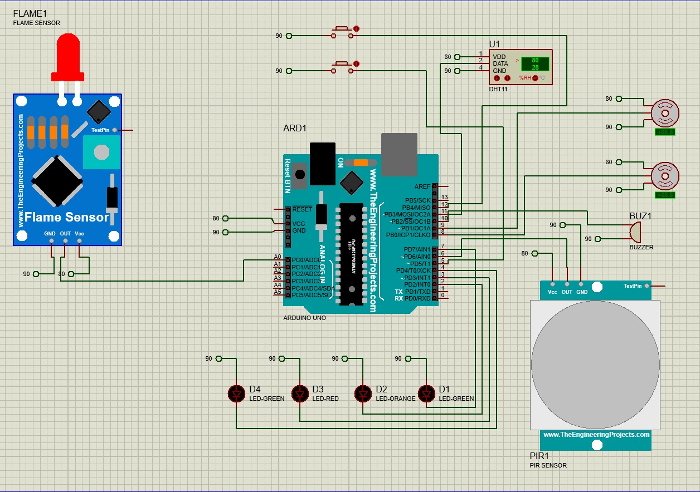

# Smart-House

## Description

The project to design and build a control system for a smart home based on the Arduino Uno board aims to create an automated, intelligent home environment. The main objective is to develop a system system that will enable users to control and monitor various devices and and functions of their home in an efficient and practical way.

## Demo 

## Docs

[Report (.pdf)](docs/arduino.pdf)